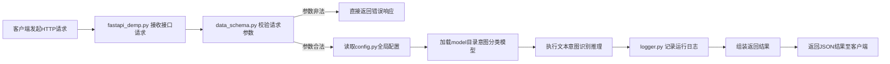

# 作业2 答案
## 一、项目文件/文件夹作用梳理
### 文件夹
1. `.idea`：IDE配置目录，存放编辑器本地配置，无业务功能
2. `__pycache__`：Python自动生成的代码缓存目录
3. `assets`：静态资源文件目录
4. `doc`：项目相关说明文档
5. `logs`：日志存储文件夹
6. `model`：保存意图分类模型权重、推理模型文件
7. `test`：测试脚本目录
8. `training_code`：意图识别模型训练代码

### 代码文件
1. `config.py`：全局配置，模型路径、服务参数、环境配置
2. `data_schema.py`：基于Pydantic定义**请求体、响应体数据结构**，自动校验入参合法性
3. `fastapi_demp.py`：FastAPI接口服务主文件，定义路由、接收HTTP请求，业务逻辑入口
4. `logger.py`：日志工具封装，统一打印、持久化日志
5. `main.py`：项目全局初始化/启动入口
6. `README.md`：项目部署、使用说明文档
7. `app.log`：程序运行日志文件

## 二、请求全流程（客户端请求 → 返回结果）
### 文字流程（可直接照着手绘流程图）
```
客户端发送HTTP请求
        ↓
【fastapi_demp.py】FastAPI接收路由请求
        ↓
【data_schema.py】自动校验请求参数（格式、必填项，参数错误直接返回异常）
        ↓
【config.py】读取项目全局配置，加载意图识别模型
        ↓
加载model目录下模型，执行文本意图分类推理
        ↓
【logger.py】记录请求内容、识别结果、耗时，写入日志
        ↓
封装标准化JSON响应数据
        ↓
返回识别结果给客户端
```

## Mermaid流程图（可复制到笔记软件渲染，或者手绘参考）

