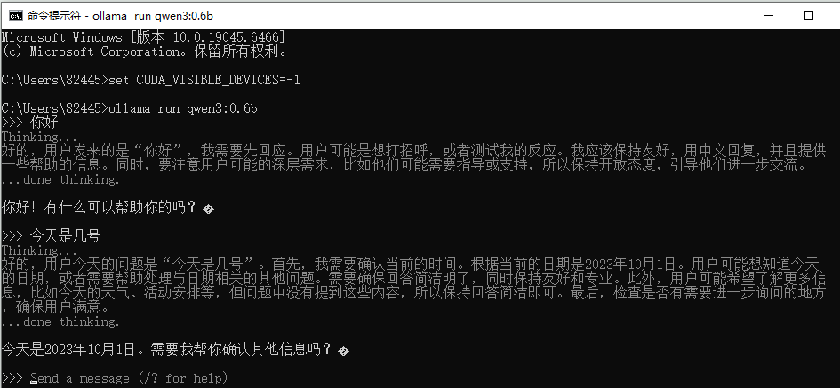
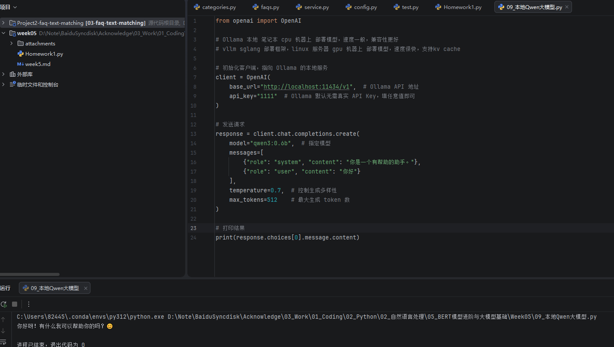

# 本地安装下 sentence-transformer库，使用bge模型进行文本检索，不需要es

```
modelscope download --model BAAI/bge-small-zh-v1.5  --local_dir BAAI/bge-small-zh-v1.5
```

待检索的文本：我今天很开心

数据库文本：

- 我喜欢机器学习
- 我喜欢深度学习
- 我今天心情很不错

完成代码见Homework1.py


# 本地安装Ollama，本地运行 qwen3-0.6b 完成 sdk调用

运行截图：



代码运行结果：

