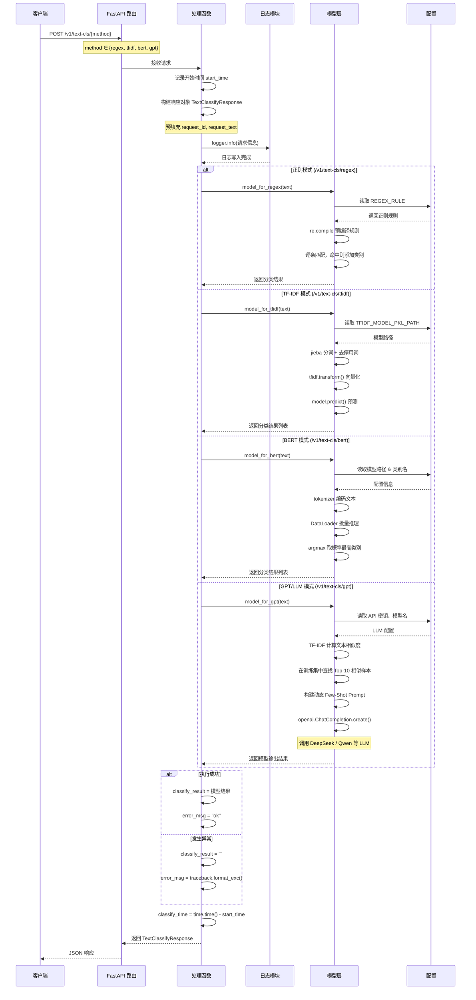

# 运行环境配置
1. 根据from a，如果缺失a依赖，在对应的虚拟环境下执行命令：
```shell
pip install a
```

2. asset中缺失模型，可以在modelscope中搜索对应模型，下载对应模型放到assets/models中
```shell
cd assets
mkdir models
cd models
modelscope download --model google-bert/bert-base-chinese  --local_dir .
```

3. 获得训练数据
    * 进入training_code目录下
    * 增加常数定义asets的路径，并将train_bert.py和train_tfidf.py中包含assets的路径替换
    ```python
    K_ASSET_PATH='../assets'
    # 读取数据集
    dataset_df = pd.read_csv(K_ASSET_PATH + '/dataset/dataset.csv', sep='\t', header=None)
    # 其余包含assets的路径也做同样的调整即可
    ```
    * 运行train_bert.py和train_tfidf.py，会在assets目录下自动生成weights目录，并将训练好的模型数据保存到weights目录下

4. 配置调整
    修改config.py，修改如下三个常量为自己的api相关数据
    ```python
    LLM_OPENAI_SERVER_URL = f"https://dashscope.aliyuncs.com/compatible-mode/v1" # ollama
    LLM_OPENAI_API_KEY = "sk-3b63e3a86139434e94dc5e64eee50745"
    LLM_MODEL_NAME = "qwen-plus"
    ```

5. 运行main.py
```shell
uvicorn main:app --reload
```

6. 观察结果及其现象
该项目采用的是post装饰的，无法直接通过 http://127.0.0.1:8000/v1/text-cls/tfidf 之类的来访问相关接口
可以通过 http://127.0.0.1:8000/docs FastAPI 自带的 Swagger UI 来访问相关接口

# 项目流程

## 详细流程图


## 各模块机制

### 正则表达式模型 (`model/regex_rule.py`)
```
输入文本 → 遍历 REGEX_RULE 每条规则 → re.findall 匹配 → 添加类别
```

- **规则定义**在 `config.py` 的 `REGEX_RULE` 字典中
- 规则预编译为 `REGEX_RULE_COMPILED`，避免每次请求重复编译
- 多个关键词用 `|` 连接，一条命中即归类
- 未命中任何规则 → 归为 `Other`

```python
REGEX_RULE = {
    "FilmTele-Play": ["播放", "电视剧"],
    "HomeAppliance-Control": ["空调", "广播"]
}
```


### TF-IDF + ML 模型 (`model/tfidf_ml.py`)

```
输入文本 → jieba 分词 → 去停用词 → TF-IDF 向量化 → model.predict() → 类别
```

- **加载**: `joblib.load()` 加载预训练的 TF-IDF + 分类器（pipeline）
- **停用词**: 使用百度停用词表过滤无意义词语
- **推理**: 分词后 transform 为 TF-IDF 特征向量，classifier 预测类别
- **特点**: 无状态、速度快，适合高并发

### BERT 模型 (`model/bert.py`)

```
输入文本 → tokenizer 编码 → DataLoader 批量推理 → argmax → 映射为类别名
```

- **模型**: `BertForSequenceClassification`，12 分类（num_labels=12）
- **加载**: 从本地加载预训练权重 `bert-base-chinese` + 微调权重 `bert.pt`
- **设备**: 优先 CUDA GPU，fallback 到 CPU
- **推理**: 通过 DataLoader 按 batch_size=16 分批推理
- **后处理**: `argmax(logits)` 取最高分索引，映射到 `CATEGORY_NAME`
- **特点**: 深度语义理解，精度高，推理速度慢

### GPT/LLM 模型 (`model/prompt.py`)

```
输入文本 → TF-IDF 相似度计算 → 训练集检索 Top-10 → 构建动态 Few-Shot Prompt → LLM 调用 → 类别
```

- **动态 Few-Shot**: 利用 TF-IDF 在当前文本与训练集之间计算余弦相似度，取 Top-10 最相似样本作为 Prompt 中的参考例子
- **Prompt 模板**:
  ```
  你是一个意图识别的专家，请结合待选类别和参考例子进行意图分类。
  待选类别：{类别列表}

  历史参考例子如下：
  {Top-10 相似样本}

  待识别的文本为：{输入文本}
  只需要输出意图类别（从待选类别中选一个），不要其他输出。
  ```
- **LLM 后端**: 支持 OpenAI 兼容接口，可通过 `config.py` 切换：
  - DeepSeek (`deepseek-v4-flash`)
  - Qwen (通义千问)
  - 任何兼容 OpenAI API 的本地/云端模型
- **参数**: `temperature=0` 保证确定性输出，`max_tokens=64` 限制输出长度
- **特点**: 无需训练、冷启动可用、利用 LLM 的语义理解能力

---