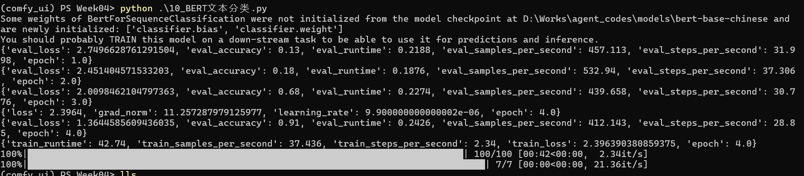
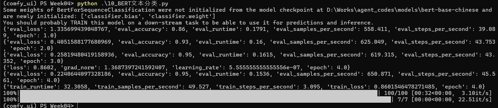
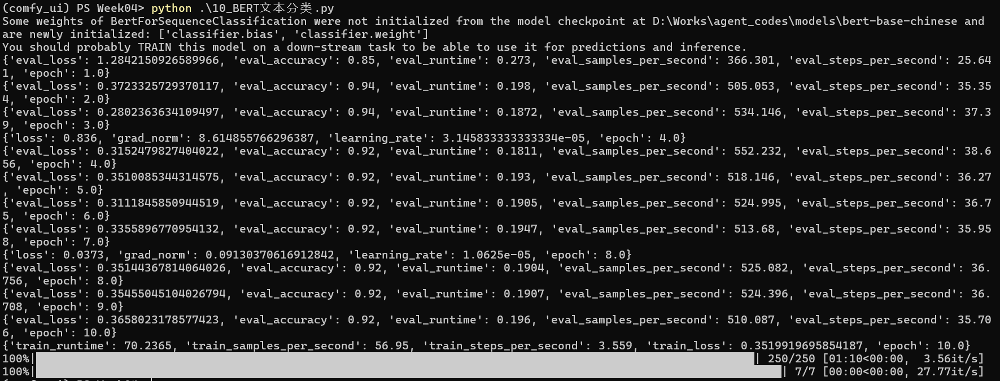
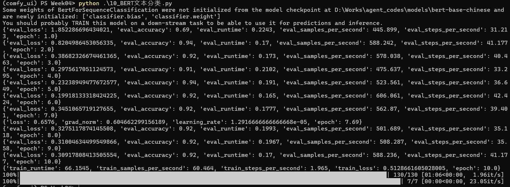

# 微调过程过程理解
## 1. 默认参数：
```python
training_args = TrainingArguments(
    output_dir='./results',              # 训练输出目录，用于保存模型和状态
    num_train_epochs=4,                  # 训练的总轮数
    per_device_train_batch_size=16,      # 训练时每个设备（GPU/CPU）的批次大小
    per_device_eval_batch_size=16,       # 评估时每个设备的批次大小
    warmup_steps=500,                    # 学习率预热的步数，有助于稳定训练， step 定义为 一次 正向传播 + 参数更新
    weight_decay=0.01,                   # 权重衰减，用于防止过拟合
    logging_dir='./logs',                # 日志存储目录
    logging_steps=100,                   # 每隔100步记录一次日志
    eval_strategy="epoch",               # 每训练完一个 epoch 进行一次评估
    save_strategy="epoch",               # 每训练完一个 epoch 保存一次模型
    load_best_model_at_end=True,         # 训练结束后加载效果最好的模型
)
```
训练结果如下：


## 2. 学习率预热步数调整
修改`warmup_steps`为`10`，训练结果如下：


## 3. 训练轮数调整
修改`num_train_epochs`为`10`，训练结果如下：


## 4. 权重衰减值调整
修改`weight_decay`为`0.005`，训练结果如下：


## 5. 训练批次大小调整
修改`per_device_train_batch_size`为`32`，训练结果如下：


## 结果对比与释义
### 1 VS 2
|指标 | 含义| 1|2| 备注|
|---|---|---|---|---|
|eval_accuracy| 测试集预测正确比例|0.91 |0.95| |
|eval_loss| 测试集上的交叉熵损失|1.36 |0.22| 越低越好，比accuracy更敏感 |
|train_loss|训练集上的平均损失| 2.396| 0.860| 低 = 拟合训练数据；但要和 eval 对照看|
|grad_norm| 梯度范数|当前学习率|11.26（波动大） | 1.37（稳定）| 越大说明越不稳定 |
|learning_rate| 9.9e-6（还在预热） |5.6e-7（已衰减到 0） | 用于确认学习率调度是否走完|
|eval_runtime/samples_per_second| 推理速度|0.2426/412.143 | 0.1536/650.87| |
|train_runtime| 训练总耗时|42.74 | 32.3058| |

预热步数太高并不好，会导致训练速度变慢，并且会导致训练效果变差。
epoch 1 的 accuracy 
在默认配置下为0.13
修改2中为 0.86，收敛速度更快

### 2 VS 3
|指标 | 含义| 2|3| 备注|
|---|---|---|---|---|
|eval_accuracy| 测试集预测正确比例|0.95 |0.92| |
|eval_loss| 测试集上的交叉熵损失|0.22 |0.3658| 越低越好，比accuracy更敏感 |
|train_loss|训练集上的平均损失| 0.860| 0.35199| 低 = 拟合训练数据；为防止过拟合，要和 eval 对照看|
|grad_norm| 梯度范数|1.37（稳定） | 0.09130（稳定）| 越大说明越不稳定 |
|learning_rate| 5.6e-7（已衰减到 0） |1.0625e-05 | 用于确认学习率调度是否走完|
|eval_runtime/samples_per_second| 推理速度| 0.1536/650.87| 0.196/510.087| |
|train_runtime| 训练总耗时| 32.3058| 70.2365| |

从修改3中可以发现当模型的训练轮数增加的时候，模型并不一定更优，它可能带来过拟合的风险
train_loss：epoch 4 是 0.836 → epoch 8 只剩 0.037（训练集几乎被"背下来"了）
eval_loss：从 epoch 3 的 0.280 一路爬到 0.366（测试集表现反而变差）
两者反向 → 模型记住了训练集细节，泛化变差

### 3 VS 4
|指标 | 含义| 3|4| 备注|
|---|---|---|---|---|
|eval_accuracy| 测试集预测正确比例|0.92 |0.95| |
|eval_loss| 测试集上的交叉熵损失|0.3658 |0.2274| 越低越好，比accuracy更敏感 |
|train_loss|训练集上的平均损失| 0.35199| 0.3712| 低 = 拟合训练数据；为防止过拟合，要和 eval 对照看|
|grad_norm| 梯度范数|0.09130 | 1.121| 越大说明越不稳定 |
|learning_rate| 1.0625e-05 |1.0625e-05 | 用于确认学习率调度是否走完|
|eval_runtime/samples_per_second| 推理速度| 0.196/510.087|0.189/529.102| |
|train_runtime| 训练总耗时| 70.2365|72.0079| |

从这里可以看出，该变量可以在出现过拟合时，通过增加权重衰减来缓解过拟合问题。

### 4 VS 5
|指标 | 含义| 4|5| 备注|
|---|---|---|---|---|
|eval_accuracy| 测试集预测正确比例|0.95 |0.92| |
|eval_loss| 测试集上的交叉熵损失|0.2274 |0.3091| 越低越好，比accuracy更敏感 |
|train_loss|训练集上的平均损失| 0.3712| 0.5128| 低 = 拟合训练数据；为防止过拟合，要和 eval 对照看|
|grad_norm| 梯度范数|1.121 | 0.60466| 越大说明越不稳定 |
|learning_rate| 1.0625e-05 |1.291666e-05 | 用于确认学习率调度是否走完|
|eval_runtime/samples_per_second| 推理速度| 0.189/529.102|0.17/588.236| |
|train_runtime| 训练总耗时| 72.0079|66.1545| |

可以看出该变量主要影响梯度稳定性