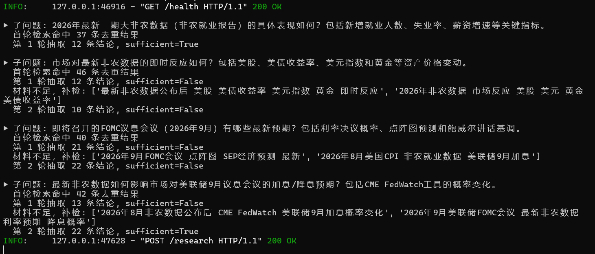
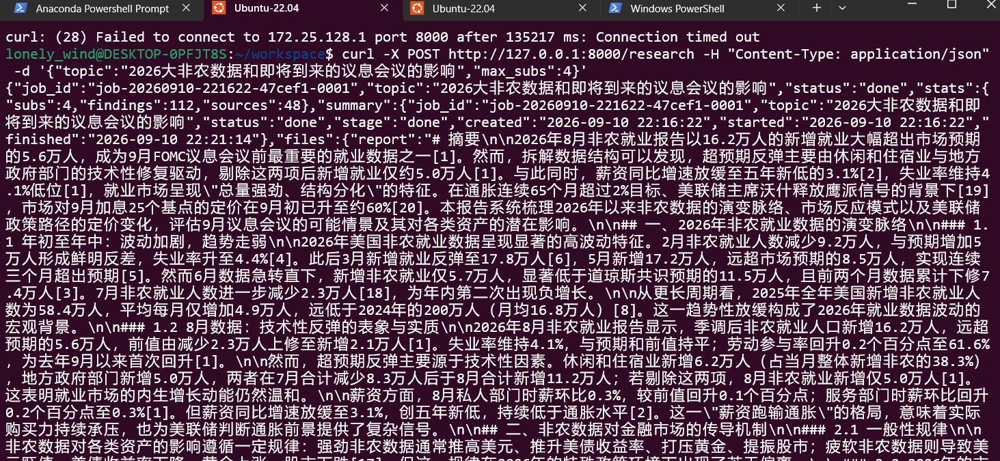

# 综合案例 02 · 深度研究助手

**业务背景**：市场 / 产品同学经常要对一个主题做调研（竞品分析、行业趋势、技术选型、政策解读）。人工搜索几十个网页、整理资料、写报告，一个主题动辄 2~3 小时，还容易漏信息、来源不可追溯。希望有一个工具能自动完成**深度研究**：输入一个主题，自动检索、阅读、迭代、综合，最终产出一份带来源引用的研究报告。

**产品定位**：「深度研究助手」——输入一个研究主题，输出：

1. 一份**结构化研究报告**（摘要、分节正文、关键结论、遗留问题）
2. **来源列表**（每条结论关联 URL / 标题 / 来源，可追溯）
3. **研究过程记录**（检索了哪些关键词、读了哪些页面、迭代了几轮）
4. **置信度说明**（结论的可靠程度、信息截止时间、无来源结论标注为"模型推断"）

**核心流程**（区别于一次性问答）：规划（拆子问题）→ 多轮检索 → 阅读抽取 → 判断是否需要补检 → 综合生成报告。

# 搜索工具

https://bocha-ai.feishu.cn/wiki/RXEOw02rFiwzGSkd9mUcqoeAnNK

```
curl -X POST "https://api.bocha.cn/v1/web-search" \
  -H "Authorization: Bearer sk-xxxx" \
  -H "Content-Type: application/json" \
  -d '{"query":"天空为什么是蓝色的？","summary":true,"count":10}'
```

---

# 深度研究助手 · 作业实现说明

本目录包含对上方「综合案例 02 · 深度研究助手」的一份可运行实现：输入一个研究主题，
Agent 自动完成 **规划子问题 → 多轮检索 → 阅读抽取 → 判断是否补检 → 综合成稿**，
最终产出一份带来源引用的研究报告。

## 一、运行方式

```bash
pip install -r requirements.txt          # 依赖 requests / beautifulsoup4
cp .env.example .env                     # 填入大模型与博查 Key（见第四节）

python main.py "研究主题"                  # 一键自动研究并产出 4 类成品
python main.py "研究主题" --plan-only      # 只打印拆解的子问题，不检索
python main.py "研究主题" --no-cache       # 忽略磁盘缓存，强制重新检索
python main.py "研究主题" --max-subs 4 --max-rounds 2   # 调节规模
```

示例（本目录已跑过一次）：

```bash
python main.py "大非农数据及即将到来的议息会议的影响与挑战"
```

产出目录 `output/大非农数据及即将到来的议息会议的影响与挑战/`，内含：

| 文件 | 对应需求 |
|---|---|
| `report.md` | 结构化研究报告（摘要 / 分节正文 / 关键结论 / 遗留问题，正文含 [n] 来源引用） |
| `sources.md` | 来源列表（每条 [n] 对应 URL / 标题 / 站点 / 日期） |
| `process.md` | 研究过程记录（子问题、每轮检索词、抽取条数、补检轮次） |
| `confidence.md` | 置信度说明（high/medium/low/inference，推断结论单列） |

## 二、整体流程

```
规划(LLM拆 4~6 子问题, 含中/英检索词)
  ↓  对每个子问题 串行
检索(bocha web-search, 中英双语 query, URL去重, 磁盘缓存)
  ↓
阅读(HTTP 抓正文, bs4 清洗; 失败回退到 bocha 的 summary)
  ↓
抽取(LLM 从材料中提取带 source_url 的结论, 并判断材料是否足够)
  ↓  不足 → 最多补检 1 轮(extra_queries)
综合(LLM 依据全部证据写报告, 句尾 [n] 标注来源; 超范围引用会被剔除)
```

## 三、代码结构

| 文件 | 职责 |
|---|---|
| `main.py` | CLI 编排：规划 / 逐子问题研究 / 综合成稿；`url_meta.json`、`findings.json`、`process.json` 持久化 |
| `llm.py` | OpenAI 兼容适配层：`base_url/api_key/model` 全走环境变量，可切换 DeepSeek / Qwen / GLM 等 |
| `search.py` | 博查搜索客户端 + 磁盘缓存 |
| `reader.py` | 网页正文抓取与清洗，失败返回 None（调用方回退摘要） |
| `reporter.py` | 生成 report / sources / process / confidence 四个 markdown，并清洗越界引用 |

## 四、多模型与配置

只依赖 **OpenAI 兼容协议**，改 `.env` 即可切换模型（`llm.py` 优先读 `LLM_*`，否则回退 `DEEPSEEK_*`）：

```bash
# DeepSeek（已测试）
DEEPSEEK_API_KEY=sk-xxx
DEEPSEEK_BASE_URL=https://api.deepseek.com
DEEPSEEK_MODEL=deepseek-chat

# 换成通义千问
# LLM_API_KEY=sk-xxx
# LLM_BASE_URL=https://dashscope.aliyuncs.com/compatible-mode/v1
# LLM_MODEL=qwen-plus

# 换成智谱 GLM
# LLM_BASE_URL=https://open.bigmodel.cn/api/paas/v4
# LLM_MODEL=glm-4-plus

# 博查搜索
BOCHA_API_KEY=sk-xxx
```

`.env` 已被 gitignore，不会提交；`cache/`（检索与抓取缓存）也已 gitignore。

## 五、设计取舍

- **多轮 + 可补检**：每个子问题先检索 1 轮，LLM 判定材料不足时用 `extra_queries` 再补检 1 轮（`--max-rounds` 控制），贴合 README 的"判断是否需要补检"。
- **双语检索**：规划阶段同时产出中文与英文 query，提升海外宏观 / 官方信源命中率（如 bls.gov、federalreserve.gov、Reuters）。
- **来源可追溯**：每条结论抽取时绑定 `source_url`，正文 [n] 引用与 `sources.md` 一一对应；报告生成后自动剔除超出来源范围的编号，防止模型"编造引用"。
- **置信度分级**：结论按 high（多源/官方）/ medium / low / inference（模型推断、无来源）标注，时间口径取运行时当前时间。
- **缓存可复现**：bocha 检索与页面抓取落盘缓存，重跑同主题不重复消耗配额；`--no-cache` 强制刷新。

---

# FastAPI 服务化

同一个 agent 已封装为可部署的 FastAPI 服务（`api.py`）。**默认一次调用拿全量成品**：
`POST /research` 会阻塞等待研究跑完，直接返回四类成品全文；底层用后台 worker 串行执行。

## 启动

```bash
pip install -r requirements.txt      # 已含 fastapi / uvicorn
uvicorn api:app --host 127.0.0.1 --port 8000
# 浏览器打开 http://127.0.0.1:8000/docs 查看 Swagger
```

> ⚠️ **须单进程运行**（勿加 `--workers` 或 `--workers>1`）：job 队列与注册表在进程内，多 worker 会互相找不到任务。

## 接口

| 方法 | 路径 | 说明 |
|---|---|---|
| POST | `/research` | **默认阻塞直取**：等研究完成，一次返回 `{job_id, status:"done", stats, files:{report,sources,process,confidence}}`。请求体见下 |
| GET | `/jobs` | 任务列表，可选 `?status=running\|done\|failed` 与 `?topic=<关键词>`，按创建时间倒序 |
| GET | `/jobs/{id}` | 轮询状态：`queued → running → done/failed`，含 `stage`/`detail` |
| GET | `/jobs/{id}/files` | 按 job_id 取回四类成品全文（断线恢复用） |
| GET | `/health` | 健康检查 |

`POST /research` 请求体：

```jsonc
{
  "topic": "研究主题",        // 必填
  "max_subs": 4,            // 可选，最多子问题数
  "max_rounds": 2,          // 可选，每子问题最大检索轮次
  "no_cache": false,        // 可选，忽略磁盘缓存强制重跑
  "async": false,           // 可选，true=立即返回 job_id（轮询模式），false=默认阻塞直取
  "wait_timeout": null      // 可选(秒)，阻塞等待上限；超时返回 202 + job_id(任务继续后台跑)
}
```

三种返回：
- **200** — 研究完成：`{job_id, topic, status:"done", stats:{subs,findings,sources}, summary, files:{...四类全文}}`
- **202** — `wait_timeout` 到期仍在跑：`{job_id, status:"running", stage, detail}`（用 job_id 轮询或稍后取）
- **500** — 研究失败：`{job_id, status:"failed", error}`

## 示例

```bash
# 方式一（默认）：一次调用，阻塞到跑完直接拿数据
curl -X POST http://127.0.0.1:8000/research -H "Content-Type: application/json"
 -d '{"topic":"2026大非农数据和即将到来的议息会议的影响","max_subs":4}'

# 方式二（进阶）：异步提交 + 轮询 + 取文件
curl.exe -X POST http://127.0.0.1:8000/research \
  -H "Content-Type: application/json" \
  -d '{"topic":"...","max_subs":4,"async":true}'     # -> {"job_id":"job-..."}
curl.exe http://127.0.0.1:8000/jobs/job-xxx                     # 轮询直到 done
curl.exe http://127.0.0.1:8000/jobs/job-xxx/files               # 取 4 文件全文
```

## 设计说明

- **一次拿数据**：阻塞模式在后台单 worker 串行执行研究，完成后 `threading.Event` 唤醒请求线程返回全量成品，无需手动轮询。
- **断线不丢**：job 一进队即注册并落盘 `output/jobs/<job_id>/`；阻塞请求中途断开，研究仍继续，事后用 `GET /jobs` 过滤 topic 找回或按已知 job_id 取文件。
- **Job 隔离**：每次任务成品落盘到 `output/jobs/<job_id>/`，与 CLI 的 `output/<主题>/` 互不干扰；`output/jobs/` 已在 `.gitignore` 中。
- **重启恢复**：启动时扫描 `output/jobs/`，已完成任务可继续通过 `/jobs/{id}/files` 取回；被中断的任务标记 `failed/interrupted_by_restart`。
- **Key 管理**：真实 key 只放 gitignored 的 `.env`；仓库内的 `.env.example` 与 README 均为占位符。
- **可靠性**：模型输出若被 `max_tokens` 截断成不完整 JSON，`llm.chat_json` 会逐次翻倍 token 预算重试，减少随机失败。
- CLI 与研究逻辑共用 `main.run_research(...)`，保证两种入口行为一致。

## 测试结果


